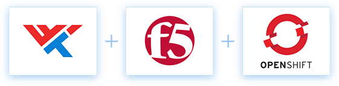
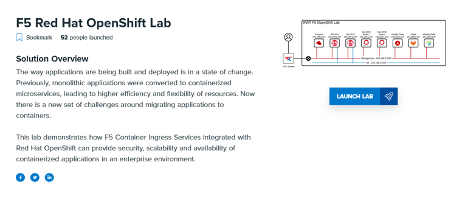

# F5 OpenShift Webinar

F5 Container Ingress Services integrated with Red Hat OpenShift can provide security, scalability, and availability of containerized applications in an enterprise environment. With application development and deployment methods changing, monolithic applications are a thing of the past while containers and microservices are on the rise. New application architectures add new complexities for engineers and developers. Learn how to simplify and accelerate the application development lifecycle, how F5 Container Ingress Services can help your organization scale and secure containers, and how Ansible can automate the configuration process with Infrastructure as Code.

Webinar Link: https://www.brighttalk.com/webcast/17822/372663
Webinar Slides: [link](slides/OpenShift-Webinar-Slides.pdf)

## Labs

WWT provides a series of labs that make the process of learning and testing OpenShift use cases easier. To get started: choose one of the labs below, [register for a WWT account](https://www.wwt.com/register), and click the Launch link on the lab page.

**F5 Red Hat OpenShift Lab**

Lab Link: https://www.wwt.com/lab/f5-red-hat-openshift-lab
Lab Guide: http://labs.wwtlab.net/lab-guides/openshift_dev_workshop/welcome.html

**Red Hat OpenShift 101 Lab**

Lab Link: https://www.wwt.com/lab/openshift-101-lab
Lab Guide: https://labs.wwtatc.com/lab-guides/openshift-cicd-demo/module_1/intro.html

**Red Hat OpenShift CI/CD Lab**

Lab Link: https://www.wwt.com/lab/openshift-cicd-lab
Lab Guide: https://labs.wwtatc.com/lab-guides/openshift-cicd-demo/module_1/intro.html

## Related Blogs and Videos

**OpenShift 4 Platform Features Automation, Upgrades and Lifecycle Management**

https://www.wwt.com/article/openshift-4-platform-features-automation-upgrades-and-lifecycle-management

**F5 RedHat OpenShift Integration Offers Secure and Scalable Applications**

https://www.wwt.com/article/f5-redhat-openshift-integration-offers-secure-and-scalable-applications

**Kubernetes without DevOps is like a Porsche without Wheels**

https://www.wwt.com/article/kubernetes-without-devops-is-like-a-porsche-without-wheels